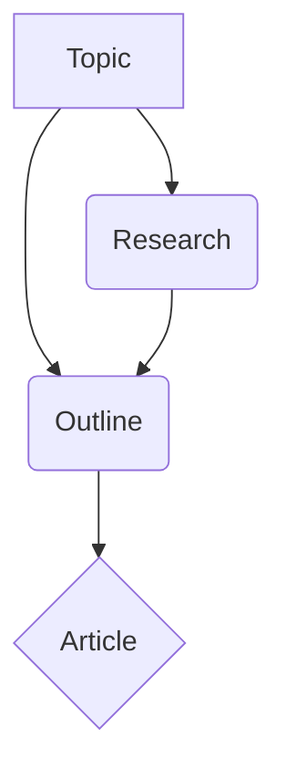
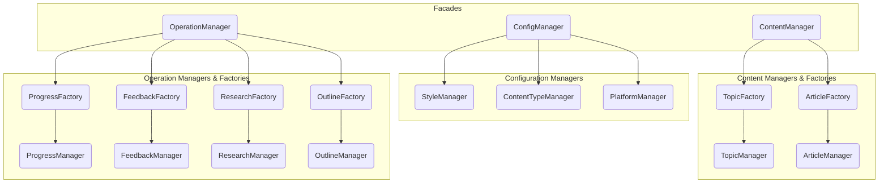

# GenFlow 术语表

本文档提供了 GenFlow 项目中使用的核心术语和概念的定义，围绕四大领域管理器进行组织：`ConfigManager`, `ContentManager`, `OperationManager`, `SimpleContentManager`。

当前状态：
- ✅ 已完成
- ⏳ 待实现

## 1. 配置领域 (ConfigManager) ✅

这些术语涉及系统的静态配置，定义了内容创建的规则、风格和目标平台。

| 术语 | 描述 | 存储方式 | 主要职责 | 管理器/Facade | Pydantic模型 | SQLAlchemy模型 |
|---|---|---|---|---|---|---|
| **ConfigManager** | **配置门面** | - | 提供访问所有配置（内容类型、风格、平台）的统一入口 | - | - | - |
| **ContentType** | 内容类型定义，描述内容的形式、结构和组织方式。 | `constants.py` + DB (Name) | 定义内容结构规范，确定写作风格限制 | `ContentTypeManager` (通过 `ConfigManager` 访问) | `ContentTypeModel` | `ContentTypeName` |
| **ArticleStyle** | 文章风格定义，描述内容的语气、风格特性和表达方式。 | JSON (`collection/`) + DB | 提供风格指导，确保内容表现统一 | `StyleManager` (通过 `ConfigManager` 访问) | `ArticleStyle` | `ArticleStyle` (DB) |
| **Platform** | 平台定义，描述发布平台的特性和限制。 | JSON (`collection/`) + DB | 规定平台发布约束，确保内容适配目标平台 | `PlatformManager` (通过 `ConfigManager` 访问) | `Platform` | `PlatformDB` |
| `ContentTypeManager` | (内部) 内容类型管理器 | - | 从 `constants.py` 加载和提供 `ContentTypeModel` 配置 | `ConfigManager` | - | - |
| `StyleManager` | (内部) 风格管理器 | - | 从 JSON 加载、管理和保存 `ArticleStyle` 配置 | `ConfigManager` | - | - |
| `PlatformManager` | (内部) 平台管理器 | - | 从 JSON 加载和提供 `Platform` 配置 | `ConfigManager` | - | - |

## 2. 内容领域 (ContentManager) ⏳

这些术语代表系统处理和管理的**核心内容实体**。

| 术语 | 描述 | 存储方式 | 关联关系 | 管理器/Facade | Pydantic模型 | SQLAlchemy模型 |
|---|---|---|---|---|---|---|
| **ContentManager** | **内容门面** | - | 提供访问核心内容实体（话题、文章等）的统一入口 | - | - | - |
| **Topic** | 话题模型，内容创作的起点。 | 数据库 | 可关联多个研究、大纲、文章 | `TopicManager` (通过 `ContentManager` 访问) | `Topic` (待定) | `TopicDB` (待定) |
| **Article** | 文章模型，表示一篇完整的文章。 | 文件系统 + 数据库 | 可关联到话题、大纲、内容类型、风格 | `ArticleManager` (通过 `ContentManager` 访问) | `Article` (待定) | `ArticleDB` (待定) |
| *Platform (实体)* | *如果平台不仅是配置，还包含状态等信息，则可能作为实体管理* | 数据库? | - | `PlatformManager`? (通过 `ContentManager` 访问) | `Platform`? (可能扩展) | `PlatformDB` |
| `ArticleManager` | (内部) 文章管理器 | - | 管理文章的存储和检索 | `ContentManager` | - | - |
| `TopicManager` | (内部) 话题管理器 | - | 管理话题的存储和检索 | `ContentManager` | - | - |
| `ArticleFactory` | (内部) 文章工厂 | - | 处理文章创建/更新的业务逻辑、验证、模型转换 | `ContentManager` (间接) | - | - |
| `TopicFactory` | (内部) 话题工厂 | - | 处理话题创建/更新的业务逻辑、验证、模型转换 | `ContentManager` (间接) | - | - |

## 3. 操作过程领域 (OperationManager) ✅

这些术语代表内容生成中的**过程跟踪信息**。

| 术语 | 描述 | 存储方式 | 关联关系 | 管理器/Facade | Pydantic模型 | SQLAlchemy模型 |
|---|---|---|---|---|---|---|
| **OperationManager** | **操作过程门面** | - | 提供对进度和反馈模块的统一访问入口，遵循门面模式，仅封装底层子系统的功能 | - | - | - |
| **Progress** | 进度信息，跟踪内容生产过程中的各个阶段。 | 数据库 | 关联到实体（如文章） | `ProgressManager` (通过 `OperationManager` 访问) | `ArticleProductionProgress` | `ProgressDB` |
| **Feedback** | 反馈信息，包括内容和研究的评价。 | 数据库 | 关联到内容或研究 | `FeedbackManager` (通过 `OperationManager` 访问) | `ResearchFeedback`, `ContentFeedback` | `FeedbackDB`, `ResearchFeedbackDB`, `ContentFeedbackDB` |

## 4. 数据流与关系总结

### 核心流程



### 配置应用

```mermaid
graph TD
    subgraph 配置 (通过 ConfigManager)
        CT[ContentType]
        AS[ArticleStyle]
        PL[Platform]
    end

    subgraph 内容生成 (通过 ContentManager/OperationManager)
        Topic --> Research --> Outline --> Article
    end

    配置 --> 内容生成
```

### 管理器层级



*(注意: 上图仅为示意，实际依赖关系可能更复杂)*

## 5. 配置与数据的区别

*   **配置 (Config Domain)**: 定义规则、约束、标准。相对静态，由开发者/管理员定义，主要通过 `ConfigManager` 访问。
*   **数据 (Content & Operation Domains)**: 表示系统处理的实际内容和中间产物。动态变化，由用户输入或系统生成，主要通过 `ContentManager` 和 `OperationManager` 访问和操作。
