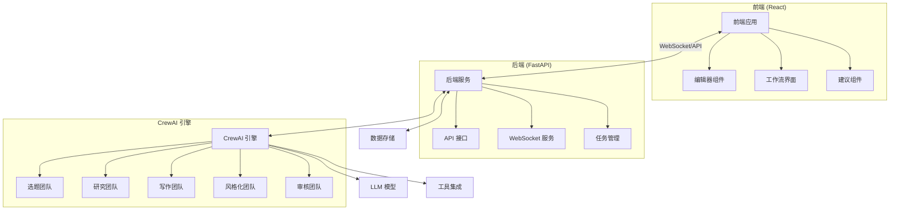
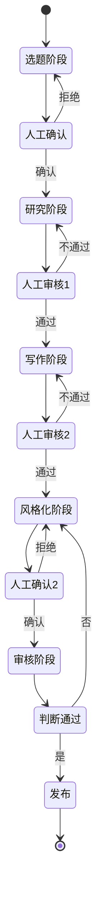

# GenFlow 内容生产系统集成指南

## 1. 系统架构概述

GenFlow 是一个完整的内容生产系统，由前端交互界面和后端智能引擎组成，支持从选题到发布的全流程内容创作。

### 1.1 系统组件



### 1.2 内容生产流程

GenFlow 系统内容生产流程分为五个核心阶段：

1. **选题阶段**：发现热门话题，评估话题价值和市场需求
2. **研究阶段**（可选）：深入研究选定主题，收集素材和观点
3. **写作阶段**：生成原创内容，包括大纲、草稿和完善
4. **风格化阶段**：适配目标平台的风格和格式要求
5. **审核阶段**：检查内容质量、原创性和合规性

每个阶段都由特定的 CrewAI 智能体团队负责处理，并通过 WebSocket 与前端进行实时交互。

## 2. 前端与后端交互

### 2.1 API 接口规范

#### 基础信息
- 基础路径：`/api/ai-assistant`
- WebSocket 基础路径：`ws://api/ai-assistant`
- 所有请求需包含标准请求头

#### 标准请求头
```http
Content-Type: application/json
Accept: application/json
X-Request-ID: <uuid>
X-Client-Version: <version>
Authorization: Bearer <token>
```

#### 核心端点
| 端点 | 方法 | 描述 |
|------|------|------|
| `/sessions` | POST | 创建写作会话 |
| `/sessions/{sessionId}` | GET | 获取会话状态 |
| `/sessions/{sessionId}/messages` | POST | 发送消息 |
| `/sessions/{sessionId}/suggestions` | GET | 获取写作建议 |

### 2.2 WebSocket 实时通信

WebSocket 用于实现前端与后端的实时通信，支持以下事件类型：

#### 助手事件类型
- `suggestion.new`: 新的写作建议
- `suggestion.update`: 建议更新
- `analysis.progress`: 分析进度
- `outline.generated`: 大纲生成
- `review.complete`: 审阅完成
- `stage.change`: 写作阶段变更

#### 客户端事件类型
- `request.suggestion`: 请求写作建议
- `request.analysis`: 请求内容分析
- `request.outline`: 请求生成大纲
- `feedback`: 提供反馈
- `stage.select`: 选择写作阶段

### 2.3 编辑器集成

编辑器组件通过专用的工具 API 与后端服务交互，支持实时编辑、建议和自动补全功能。

#### 编辑器事件类型
- `edit.insert`: 插入内容
- `edit.delete`: 删除内容
- `edit.replace`: 替换内容
- `edit.format`: 格式化
- `cursor.move`: 光标移动
- `selection.change`: 选区变化
- `completion.suggest`: 自动补全建议

## 3. CrewAI 团队结构

### 3.1 系统架构

CrewAI 是 GenFlow 系统的核心智能引擎，基于多智能体协作完成内容生产任务。系统目录结构如下：

```
src/
├── tools/                    # 基础工具封装
│   ├── content_collectors/   # 内容采集工具
│   ├── search_tools/        # 搜索工具
│   └── nlp_tools/           # NLP工具
├── agents/                   # CrewAI 智能体
│   ├── topic_crew/          # 选题团队
│   ├── research_crew/       # 研究团队
│   ├── writing_crew/        # 写作团队
│   └── review_crew/         # 审核团队
├── models/                   # 数据模型
│   ├── topic.py            # 选题模型
│   ├── article.py          # 文章模型
│   └── platform.py         # 平台模型
└── services/                # 业务服务
    ├── topic_service.py     # 选题服务
    ├── research_service.py  # 研究服务
    ├── writing_service.py   # 写作服务
    └── review_service.py    # 审核服务
```

### 3.2 各团队职责

#### 选题团队 (Topic Crew)
- **职责**: 发现热门话题、评估话题价值
- **工具**:
  - SearchAggregator: 搜索热门话题
  - GoogleTrendsTool: 分析话题趋势
  - ContentCollector: 收集相关内容
- **智能体**:
  - 趋势分析师：挖掘热门趋势
  - 主题研究员：分析话题价值
  - 报告撰写员：生成话题报告

#### 研究团队 (Research Crew)
- **职责**: 深入研究选定话题、收集素材
- **工具**:
  - ContentCollector: 采集深度内容
  - NLPAggregator: 内容分析
  - SearchAggregator: 补充搜索
- **智能体**:
  - 资料收集员：收集相关资料
  - 内容分析师：分析关键信息
  - 验证专员：验证事实准确性

#### 写作团队 (Writing Crew)
- **职责**: 生成原创内容
- **工具**:
  - NLPAggregator: 内容生成
  - SummaTool: 摘要生成
  - YakeTool: 关键词提取
- **智能体**:
  - 大纲设计师：创建文章结构
  - 内容创作者：撰写主体内容
  - 编辑：完善文章细节

#### 风格化团队 (Styling Crew)
- **职责**: 适配目标平台风格
- **工具**:
  - NLPAggregator: 风格转换
  - SpacyTool: 语言分析
- **智能体**:
  - 风格专家：调整文章风格
  - 平台适配师：优化平台体验
  - 语言润色师：提升表达质量

#### 审核团队 (Review Crew)
- **职责**: 内容合规性检查
- **工具**:
  - PlagiarismChecker: 查重工具
  - AIDetector: AI内容检测
  - SensitiveChecker: 敏感词检查
- **智能体**:
  - 查重专员：检查原创性
  - AI检测员：识别AI生成内容
  - 内容审核员：审核合规性
  - 质量评估师：评估内容质量
  - 终审专员：做出最终决定

## 4. 工作流与状态管理

### 4.1 写作阶段与状态流转



### 4.2 写作进度跟踪

```typescript
interface WritingProgress {
  stage: 'topic' | 'research' | 'writing' | 'styling' | 'review';
  status: 'idle' | 'processing' | 'waiting';
  progress: number;  // 0-100
  estimatedTime?: number;  // 预估剩余时间(秒)
  currentStep?: string;  // 当前步骤描述
}
```

### 4.3 WebSocket 状态同步

后端在以下情况会主动推送状态更新：
1. 进度更新 (每5%)
2. 阶段转换
3. 需要人工确认
4. 完成特定任务(如大纲生成)
5. 发生错误

## 5. 前端集成实现

### 5.1 写作助手组件集成

```jsx
// 写作助手主组件
function WritingAssistant({ articleId }) {
  const [session, setSession] = useState(null);
  const [progress, setProgress] = useState(null);
  const [messages, setMessages] = useState([]);
  const [suggestions, setSuggestions] = useState([]);
  const [actions, setActions] = useState([]);

  // 初始化写作会话
  useEffect(() => {
    async function initSession() {
      const response = await fetch('/api/ai-assistant/sessions', {
        method: 'POST',
        headers: { /* 标准请求头 */ },
        body: JSON.stringify({ articleId })
      });
      const data = await response.json();
      setSession(data.data);
      setProgress(data.data.progress);
      setActions(data.data.availableActions);
    }

    initSession();
  }, [articleId]);

  // WebSocket 连接
  useEffect(() => {
    if (!session) return;

    const ws = new WebSocket(`ws://api/ai-assistant/sessions/${session.sessionId}/realtime`);

    ws.onmessage = (event) => {
      const data = JSON.parse(event.data);

      switch (data.type) {
        case 'suggestion.new':
          setSuggestions(prev => [...prev, data.data]);
          break;
        case 'stage.change':
          setProgress(data.data);
          break;
        // 处理其他事件类型...
      }
    };

    return () => ws.close();
  }, [session]);

  // 组件渲染...
}
```

### 5.2 编辑器工具集成

```jsx
// 编辑器集成
function Editor({ sessionId }) {
  const editorRef = useRef(null);
  const [suggestions, setSuggestions] = useState([]);

  // 处理编辑器事件
  function handleChange(content, event) {
    // 发送编辑器变更
    fetch(`/api/ai-tool/sessions/${sessionId}/suggestions`, {
      method: 'POST',
      headers: { /* 标准请求头 */ },
      body: JSON.stringify({
        content: content,
        selection: event.selection,
        context: { /* 上下文信息 */ }
      })
    }).then(res => res.json())
      .then(data => {
        if (data.data.suggestions.length > 0) {
          setSuggestions(data.data.suggestions);
        }
      });
  }

  // 应用建议
  function applySuggestion(suggestion) {
    // 应用建议到编辑器
    fetch(`/api/ai-tool/articles/${articleId}/apply`, {
      method: 'POST',
      headers: { /* 标准请求头 */ },
      body: JSON.stringify({
        functions: [
          {
            type: 'replace',
            position: suggestion.position,
            content: suggestion.content
          }
        ],
        sessionId
      })
    }).then(res => res.json())
      .then(data => {
        if (data.data.applied) {
          // 更新编辑器内容
          editorRef.current.updateContent(data.data.changes);
        }
      });
  }

  // 组件渲染...
}
```

## 6. 后端实现指南

### 6.1 FastAPI 实现

```python
from fastapi import FastAPI, WebSocket, Depends, HTTPException, status
from fastapi.security import OAuth2PasswordBearer
from pydantic import BaseModel
from typing import List, Dict, Optional
import asyncio
import uuid

app = FastAPI()
oauth2_scheme = OAuth2PasswordBearer(tokenUrl="token")

# 数据模型
class SessionCreate(BaseModel):
    articleId: str
    initialStage: str = "topic"
    context: Dict

class Message(BaseModel):
    content: str
    type: str = "text"
    metadata: Optional[Dict] = None

# API 路由
@app.post("/api/ai-assistant/sessions")
async def create_session(
    session_data: SessionCreate,
    token: str = Depends(oauth2_scheme)
):
    # 创建会话
    session_id = str(uuid.uuid4())
    # 初始化 CrewAI 处理流程
    # ...

    return {
        "data": {
            "sessionId": session_id,
            "progress": {
                "stage": session_data.initialStage,
                "status": "idle",
                "progress": 0
            },
            "availableActions": get_available_actions(session_data.initialStage)
        },
        "metadata": {
            "timestamp": int(time.time() * 1000),
            "requestId": str(uuid.uuid4())
        }
    }

@app.post("/api/ai-assistant/sessions/{session_id}/messages")
async def send_message(
    session_id: str,
    message: Message,
    token: str = Depends(oauth2_scheme)
):
    # 处理消息
    # 调用相应的 CrewAI 功能
    # ...

    return {
        "data": {
            "message": {
                "id": str(uuid.uuid4()),
                "role": "ai",
                "content": "处理结果内容",
                "type": "text",
                "timestamp": datetime.now().isoformat()
            },
            "progress": get_session_progress(session_id)
        },
        "metadata": {
            "timestamp": int(time.time() * 1000),
            "requestId": str(uuid.uuid4())
        }
    }

# WebSocket 处理
@app.websocket("/api/ai-assistant/sessions/{session_id}/realtime")
async def websocket_endpoint(websocket: WebSocket, session_id: str):
    await websocket.accept()
    try:
        # 验证连接
        auth_message = await websocket.receive_json()
        if auth_message["type"] != "auth":
            await websocket.close(code=status.WS_1008_POLICY_VIOLATION)
            return

        # 验证 token
        # ...

        # 注册会话
        register_websocket(session_id, websocket)

        # 接收和处理消息
        while True:
            data = await websocket.receive_json()
            await process_client_event(session_id, data, websocket)

    except Exception as e:
        # 错误处理
        print(f"WebSocket error: {str(e)}")
    finally:
        # 清理会话
        unregister_websocket(session_id)
```

### 6.2 CrewAI 集成实现

```python
from crewai import Agent, Task, Crew, Process
from typing import List, Dict, Any

# 选题团队实现
class TopicCrew:
    def __init__(self, config):
        self.config = config
        self.tools = TopicTools()
        self.agents = TopicAgents(self.tools)

    async def discover_topics(self, category: str, count: int = 5) -> List[Dict]:
        # 创建智能体
        trend_analyzer = self.agents.create_trend_analyzer()
        topic_researcher = self.agents.create_topic_researcher()
        report_writer = self.agents.create_report_writer()

        # 创建任务
        analyze_trends_task = Task(
            description=f"分析'{category}'领域的热门趋势，找出潜在的热门话题",
            agent=trend_analyzer,
            expected_output="热门趋势分析报告，包含关键词和热度数据"
        )

        research_topics_task = Task(
            description="深入研究趋势分析中提到的话题，评估其价值和市场需求",
            agent=topic_researcher,
            expected_output="话题详细分析，包括受众分析和竞争情况",
            context=[analyze_trends_task]
        )

        write_report_task = Task(
            description=f"整理分析结果，生成{count}个推荐话题及详细报告",
            agent=report_writer,
            expected_output="话题推荐报告，包含每个话题的详细分析",
            context=[research_topics_task]
        )

        # 创建团队
        crew = Crew(
            agents=[trend_analyzer, topic_researcher, report_writer],
            tasks=[analyze_trends_task, research_topics_task, write_report_task],
            process=Process.sequential,
            verbose=True
        )

        # 执行团队任务
        result = await crew.kickoff()

        # 解析结果
        return self._parse_topics(result)

    def _parse_topics(self, result: Any) -> List[Dict]:
        # 从结果中解析话题
        # ...
        return topics
```

## 7. 部署与配置

### 7.1 环境配置
- 生产环境: 容器化部署 (Docker + Kubernetes)
- 开发环境: Docker Compose
- 本地开发: 基于 dotenv 的环境变量

### 7.2 前端部署
- React 应用打包为静态资源
- 通过 Nginx 提供服务
- 配置 CORS 和代理

### 7.3 后端部署
- FastAPI 通过 Uvicorn/Gunicorn 部署
- WebSocket 服务需要支持长连接
- LLM 服务可考虑独立部署

### 7.4 监控与日志
- 请求跟踪: 通过 X-Request-ID
- 性能监控: Prometheus 指标
- 用户行为分析: 客户端事件跟踪

## 8. 开发最佳实践

### 8.1 技术堆栈
- 前端: React + TypeScript + WebSocket
- 后端: FastAPI + AsyncIO + CrewAI
- 模型: OpenAI API + Anthropic Claude API
- 存储: PostgreSQL + Redis
- 监控: Prometheus + Grafana

### 8.2 代码风格
- 前端: ESLint + Prettier
- 后端: Black + isort + pylint
- API: OpenAPI 规范
- 提交: Commitlint 规范

### 8.3 错误处理
- 前端: 错误边界 + 重试机制
- 后端: 统一错误响应 + 错误日志
- API: 规范错误码和描述
- WebSocket: 断线重连机制

### 8.4 安全措施
- API 认证: OAuth2 + JWT
- WebSocket 认证: 基于 token
- 内容安全: 输入验证 + 敏感信息过滤
- 速率限制: 基于用户的请求限制

## 9. 常见问题与解决方案

### 9.1 性能优化
- WebSocket消息批处理
- LLM请求合并
- 结果缓存
- 分段传输

### 9.2 错误处理
- LLM超时重试
- 工具调用失败降级
- 断线重连策略
- 部分结果保存

### 9.3 兼容性问题
- 浏览器WebSocket支持
- 移动设备优化
- 低带宽适配
- 离线功能支持

## 10. 迭代计划

### 10.1 短期优化
- 完善工具集成
- 优化交互界面
- 提升处理效率

### 10.2 中期规划
- 引入更多AI模型
- 增强平台适配
- 优化反馈机制

### 10.3 长期目标
- 智能推荐系统
- 自动优化机制
- 知识积累系统

---

最后更新: 2024-05-15
