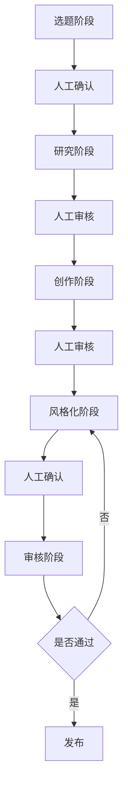

# 智能内容生产流程设计

## 1. 系统架构

### 1.1 目录结构
```
src/
├── tools/                    # 基础工具封装
│   ├── content_collectors/   # 内容采集工具
│   ├── search_tools/        # 搜索工具
│   └── nlp_tools/           # NLP工具
├── agents/                   # CrewAI 智能体
│   ├── topic_crew/          # 选题团队
│   ├── research_crew/       # 研究团队
│   ├── writing_crew/        # 写作团队
│   └── review_crew/         # 审核团队
├── models/                   # 数据模型
│   ├── topic.py            # 选题模型
│   ├── article.py          # 文章模型
│   └── platform.py         # 平台模型
└── services/                # 业务服务
    ├── topic_service.py     # 选题服务
    ├── research_service.py  # 研究服务
    ├── writing_service.py   # 写作服务
    └── review_service.py    # 审核服务
```

### 1.2 工作流程


## 2. 详细设计

### 2.1 选题阶段 (Topic Discovery)
- **职责**: 发现热门话题、评估话题价值
- **工具**:
  - SearchAggregator: 搜索热门话题
  - GoogleTrendsTool: 分析话题趋势
  - ContentCollector: 收集相关内容
- **输出**: 
  - 话题推荐列表
  - 每个话题的热度分析
  - 市场竞争分析
- **人工参与**:
  - 选择感兴趣的话题
  - 调整话题方向
  - 添加自定义话题

### 2.2 研究阶段 (Research)
- **职责**: 深入研究选定话题
- **工具**:
  - ContentCollector: 采集深度内容
  - NLPAggregator: 内容分析
  - SearchAggregator: 补充搜索
- **输出**:
  - 话题背景报告
  - 关键观点整理
  - 参考资料列表
- **人工参与**:
  - 审核研究方向
  - 补充专业知识
  - 确认研究深度

### 2.3 创作阶段 (Writing)
- **职责**: 生成原创内容
- **工具**:
  - NLPAggregator: 内容生成
  - SummaTool: 摘要生成
  - YakeTool: 关键词提取
- **输出**:
  - 文章初稿
  - 关键论点
  - SEO建议
- **人工参与**:
  - 审核内容质量
  - 调整文章结构
  - 补充专业观点

### 2.4 风格化阶段 (Styling)
- **职责**: 适配目标平台风格
- **工具**:
  - NLPAggregator: 风格转换
  - SpacyTool: 语言分析
- **输出**:
  - 平台适配版本
  - 风格建议
- **人工参与**:
  - 确认风格适配
  - 微调表达方式
  - 选择最佳版本

### 2.5 审核阶段 (Review)
- **职责**: 内容合规性检查
- **工具**:
  - 查重工具
  - AI内容检测
  - 敏感词检查
- **输出**:
  - 查重报告
  - AI检测报告
  - 合规建议
- **人工参与**:
  - 评估风险
  - 决定是否修改
  - 确认发布

## 3. 关键设计决策

### 3.1 模块化设计
- 每个阶段独立封装
- 工具可插拔架构
- 支持自定义扩展

### 3.2 人机协作
- 明确人工决策点
- 保留人工干预接口
- 支持反馈优化

### 3.3 质量保证
- 多层次审核机制
- 数据可追溯
- 版本管理

## 4. 后续优化方向

### 4.1 短期优化
- 完善工具集成
- 优化交互界面
- 提升处理效率

### 4.2 中期规划
- 引入更多AI模型
- 增强平台适配
- 优化反馈机制

### 4.3 长期目标
- 智能推荐系统
- 自动优化机制
- 知识积累系统

## 5. 实施路径

### 5.1 第一阶段
1. 基础工具开发
2. CrewAI集成
3. 核心流程实现

### 5.2 第二阶段
1. 人机交互优化
2. 平台适配开发
3. 审核系统完善

### 5.3 第三阶段
1. 数据分析系统
2. 知识库建设
3. 自动化优化 