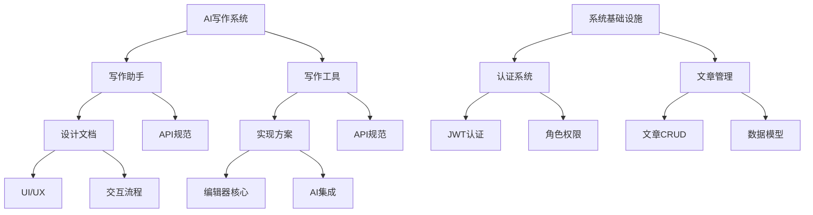

# GenFlow 文档体系

## 1. 系统基础设施

### 1.1 认证系统 (@genflow_auth_api.md)
- JWT认证机制
- 用户角色与权限
- 登录流程
- 安全考虑

### 1.2 文章管理 (@genflow_article_api.md)
- RESTful API设计
- 数据模型
- CRUD操作
- 分页与筛选
- 性能优化

## 2. AI写作系统

### 2.1 写作助手 - AI指导模块

#### 设计文档 (@ai-writing-assistant-design.md)
- 整体布局
- 写作阶段流程
- 交互设计
- 样式规范
- 状态管理

#### API规范 (@ai-writing-assistant-api.md)
- 会话管理
- 消息交互
- 写作阶段控制
- 辅助功能
- WebSocket接口

### 2.2 写作工具 - 编辑器集成模块

#### 实现方案 (@ai-writing_tool_plan.md)
- 系统架构
- 编辑器实现
- AI功能集成
- 用户体验优化
- 性能考虑

#### API规范 (@ai-writing_tool_api.md)
- 会话管理
- 实时交互
- 文档操作
- WebSocket事件
- 安全与缓存

## 3. 文档关系图

## 4. 职责划分

### 4.1 写作助手职责
- 提供写作指导和建议
- 管理写作阶段和进度
- 提供内容分析和优化建议
- 处理用户与AI的对话交互

### 4.2 写作工具职责
- 提供实时编辑器集成
- 处理文本差异和版本控制
- 实现实时AI补全和建议
- 管理文档状态和变更

## 5. 技术栈统一

### 5.1 前端技术
- Next.js + React
- TailwindCSS
- TipTap编辑器
- Socket.IO客户端

### 5.2 后端技术
- Node.js/Express
- PostgreSQL
- Redis
- Socket.IO服务器
- OpenAI API集成

## 6. 开发流程

1. 基础设施搭建
   - 认证系统实现
   - 文章管理API实现

2. 写作工具开发
   - 编辑器核心实现
   - AI实时交互集成

3. 写作助手开发
   - UI/UX实现
   - AI对话系统集成

4. 系统整合
   - 组件间通信
   - 数据流优化
   - 性能调优

## 7. 注意事项

1. API版本控制
2. 错误处理统一
3. 安全措施一致
4. 文档及时更新
5. 性能指标监控 